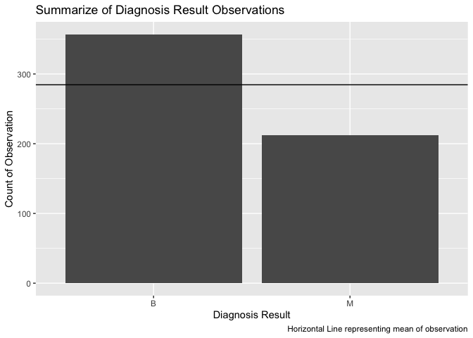
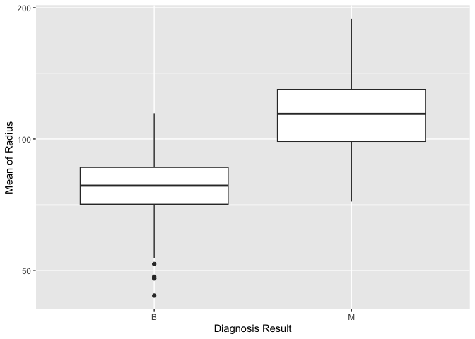
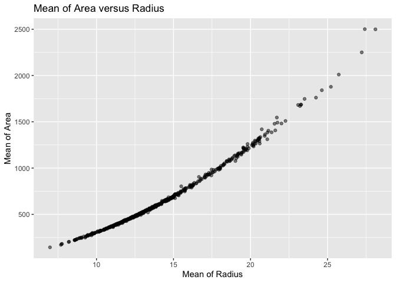
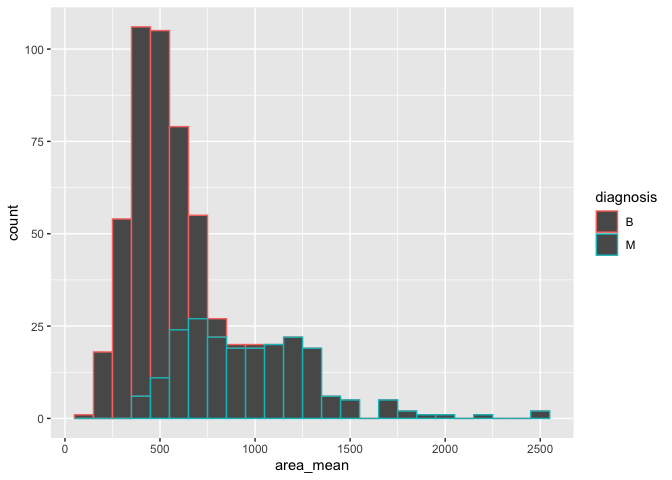
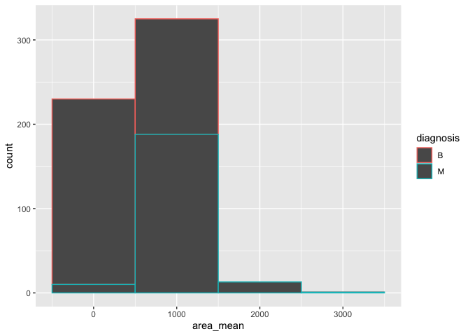
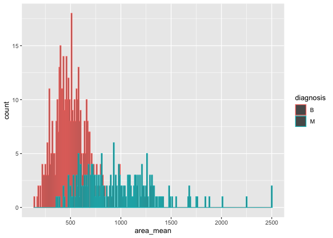

Mini Data Analysis Milestone 2
================

*To complete this milestone, you can either edit [this `.rmd`
file](https://raw.githubusercontent.com/UBC-STAT/stat545.stat.ubc.ca/master/content/mini-project/mini-project-2.Rmd)
directly. Fill in the sections that are commented out with
`<!--- start your work here--->`. When you are done, make sure to knit
to an `.md` file by changing the output in the YAML header to
`github_document`, before submitting a tagged release on canvas.*

# Welcome to the rest of your mini data analysis project!

In Milestone 1, you explored your data. and came up with research
questions. This time, we will finish up our mini data analysis and
obtain results for your data by:

- Making summary tables and graphs
- Manipulating special data types in R: factors and/or dates and times.
- Fitting a model object to your data, and extract a result.
- Reading and writing data as separate files.

We will also explore more in depth the concept of *tidy data.*

**NOTE**: The main purpose of the mini data analysis is to integrate
what you learn in class in an analysis. Although each milestone provides
a framework for you to conduct your analysis, it’s possible that you
might find the instructions too rigid for your data set. If this is the
case, you may deviate from the instructions – just make sure you’re
demonstrating a wide range of tools and techniques taught in this class.

# Instructions

**To complete this milestone**, edit [this very `.Rmd`
file](https://raw.githubusercontent.com/UBC-STAT/stat545.stat.ubc.ca/master/content/mini-project/mini-project-2.Rmd)
directly. Fill in the sections that are tagged with
`<!--- start your work here--->`.

**To submit this milestone**, make sure to knit this `.Rmd` file to an
`.md` file by changing the YAML output settings from
`output: html_document` to `output: github_document`. Commit and push
all of your work to your mini-analysis GitHub repository, and tag a
release on GitHub. Then, submit a link to your tagged release on canvas.

**Points**: This milestone is worth 50 points: 45 for your analysis, and
5 for overall reproducibility, cleanliness, and coherence of the Github
submission.

**Research Questions**: In Milestone 1, you chose two research questions
to focus on. Wherever realistic, your work in this milestone should
relate to these research questions whenever we ask for justification
behind your work. In the case that some tasks in this milestone don’t
align well with one of your research questions, feel free to discuss
your results in the context of a different research question.

# Learning Objectives

By the end of this milestone, you should:

- Understand what *tidy* data is, and how to create it using `tidyr`.
- Generate a reproducible and clear report using R Markdown.
- Manipulating special data types in R: factors and/or dates and times.
- Fitting a model object to your data, and extract a result.
- Reading and writing data as separate files.

# Setup

Begin by loading your data and the tidyverse package below:

``` r
library(datateachr) # <- might contain the data you picked!
library(tidyverse)
```

# Task 1: Process and summarize your data

From milestone 1, you should have an idea of the basic structure of your
dataset (e.g. number of rows and columns, class types, etc.). Here, we
will start investigating your data more in-depth using various data
manipulation functions.

### 1.1 (1 point)

First, write out the 4 research questions you defined in milestone 1
were. This will guide your work through milestone 2:

<!-------------------------- Start your work below ---------------------------->

1.  In the mean variables, what are some of the highest correlated
    variables with the diagnosis results?
2.  What variables presents significant difference in distribution
    between Benign and Malignant cases?
3.  Is there any significant correlation between quantitative variables?
4.  If we wish to predict on the outcome of diagnosis using the
    quantitative variables given, how accurate can we accomplish?
    <!----------------------------------------------------------------------------->

Here, we will investigate your data using various data manipulation and
graphing functions.

### 1.2 (8 points)

Now, for each of your four research questions, choose one task from
options 1-4 (summarizing), and one other task from 4-8 (graphing). You
should have 2 tasks done for each research question (8 total). Make sure
it makes sense to do them! (e.g. don’t use a numerical variables for a
task that needs a categorical variable.). Comment on why each task helps
(or doesn’t!) answer the corresponding research question.

Ensure that the output of each operation is printed!

Also make sure that you’re using dplyr and ggplot2 rather than base R.
Outside of this project, you may find that you prefer using base R
functions for certain tasks, and that’s just fine! But part of this
project is for you to practice the tools we learned in class, which is
dplyr and ggplot2.

**Summarizing:**

1.  Compute the *range*, *mean*, and *two other summary statistics* of
    **one numerical variable** across the groups of **one categorical
    variable** from your data.
2.  Compute the number of observations for at least one of your
    categorical variables. Do not use the function `table()`!
3.  Create a categorical variable with 3 or more groups from an existing
    numerical variable. You can use this new variable in the other
    tasks! *An example: age in years into “child, teen, adult, senior”.*
4.  Compute the proportion and counts in each category of one
    categorical variable across the groups of another categorical
    variable from your data. Do not use the function `table()`!

**Graphing:**

6.  Create a graph of your choosing, make one of the axes logarithmic,
    and format the axes labels so that they are “pretty” or easier to
    read.
7.  Make a graph where it makes sense to customize the alpha
    transparency.

Using variables and/or tables you made in one of the “Summarizing”
tasks:

8.  Create a graph that has at least two geom layers.
9.  Create 3 histograms, with each histogram having different sized
    bins. Pick the “best” one and explain why it is the best.

Make sure it’s clear what research question you are doing each operation
for!

<!------------------------- Start your work below ----------------------------->

1.  In the mean variables, what are some of the highest correlated
    variables with the diagnosis results? Summarize Task:

``` r
diagnosis_count <- cancer_sample %>% group_by(diagnosis) %>% summarize(n = n())
diagnosis_count
```

    ## # A tibble: 2 × 2
    ##   diagnosis     n
    ##   <chr>     <int>
    ## 1 B           357
    ## 2 M           212

From T2, the number of observations for Benign is 357 while Malignant is
212. The observation count for Benign case is roughly 70% more than
Malignant case. This task helps in understanding our diagnosis result
column.

Graph Task:

``` r
ggplot(diagnosis_count) + geom_bar(aes(x = diagnosis, y = n), stat = "identity") + geom_hline(yintercept =mean(diagnosis_count$n)) + labs(x = "Diagnosis Result", y = "Count of Observation", title = "Summarize of Diagnosis Result Observations", caption = "Horizontal Line representing mean of observation")
```

<!-- -->

From T8, we created a bar plot to visualize the summarization task
results. This visualization helps us see the difference of observation
and the mean of observations. We have a slightly biased dataset to
analyze, but the bias should be neglegible.

2.  What variables presents significant difference in distribution
    between Benign and Malignant cases? Summarize Task:

``` r
summarize_rad <- cancer_sample %>% group_by(diagnosis) %>% summarise(across(radius_mean, list(mean = mean, sd = sd, median = median, min = min, max = max)))
print(summarize_rad)
```

    ## # A tibble: 2 × 6
    ##   diagnosis radius_mean_mean radius_mean_sd radius_mean_median radius_mean_min
    ##   <chr>                <dbl>          <dbl>              <dbl>           <dbl>
    ## 1 B                     12.1           1.78               12.2            6.98
    ## 2 M                     17.5           3.20               17.3           11.0 
    ## # ℹ 1 more variable: radius_mean_max <dbl>

From T1, Here we computed summary statistics of radius_mean for each
group of diagnosis result. We have the mean, standard deviation, median,
and (min, max) as range. This helps us understand about the necessary
summary statistics between Benign and Malignant cases. We see that there
is truly a significant difference between the cases in mean of radius.

Graph Task:

``` r
ggplot(cancer_sample,aes(x = diagnosis, y = perimeter_mean)) + geom_boxplot() + labs(titie = "Mean Radius distribution versus Diagnosis Result", x = "Diagnosis Result", y = "Mean of Radius") + scale_y_log10()
```

<!-- -->

From T6, note that the scaling of logarithmic base does not show
significantly due to our concentrated data around a small interval. In
this case, it is not appropriate to apply this scaling to the axis as it
provides no value in visualization and only complicates explanation.

3.  Is there any significant correlation between quantitative variables?
    Summarize Task:

No related summarize task is found within the summarizing questions. We
will attempt on T3 on `area_mean` instead.

``` r
mean_area_mean = mean(cancer_sample$area_mean)
sd_area_mean = sd(cancer_sample$area_mean)
cancer_area <- cancer_sample %>% mutate(area_mean_fct = case_when(area_mean < mean_area_mean - 2 * sd_area_mean ~ "Very Small",
                                                   area_mean < mean_area_mean - 1 * sd_area_mean ~ "Small",
                                                   area_mean < mean_area_mean + 1 * sd_area_mean ~ "Normal",
                                                   area_mean < mean_area_mean + 2 * sd_area_mean ~ "Large",
                                                   TRUE ~ "Very Large")) %>% select(diagnosis, area_mean, area_mean_fct)
cancer_area
```

    ## # A tibble: 569 × 3
    ##    diagnosis area_mean area_mean_fct
    ##    <chr>         <dbl> <chr>        
    ##  1 M             1001  Normal       
    ##  2 M             1326  Large        
    ##  3 M             1203  Large        
    ##  4 M              386. Normal       
    ##  5 M             1297  Large        
    ##  6 M              477. Normal       
    ##  7 M             1040  Large        
    ##  8 M              578. Normal       
    ##  9 M              520. Normal       
    ## 10 M              476. Normal       
    ## # ℹ 559 more rows

Using T3, we have successfully separated `area_mean` variable into five
categories, according to one and two standard deviation away from sample
mean. This helps us organize our data and see extreme cases and
potential outliers.

Graph Task:

``` r
ggplot(cancer_sample, aes(x = radius_mean, y = area_mean)) + geom_point(alpha = 0.5) + labs(title = "Mean of Area versus Radius", x = "Mean of Radius", y = "Mean of Area")
```

<!-- -->

From T7, we clearly see by a scatterplot that there is significant
positive (sligtly non-linear) relationship between `area_mean` and
`radius_mean`. This signifies that not all variables should be used in a
linear model when fitting data. Changing the alpha value of points could
help us in tidying the plot and seeing the density of points.

4.  If we wish to predict on the outcome of diagnosis using the
    quantitative variables given, how accurate can we accomplish?
    Summarize Task:

We will try use the cancer_area dataset to do T4.

``` r
cancer_area_factor <- cancer_area %>% group_by(diagnosis, area_mean_fct) %>% summarise(n = n(), .groups = 'drop') %>% mutate(prop = n/sum(n))
cancer_area_factor
```

    ## # A tibble: 5 × 4
    ##   diagnosis area_mean_fct     n   prop
    ##   <chr>     <chr>         <int>  <dbl>
    ## 1 B         Normal          310 0.545 
    ## 2 B         Small            47 0.0826
    ## 3 M         Large            67 0.118 
    ## 4 M         Normal          122 0.214 
    ## 5 M         Very Large       23 0.0404

From T4, we can see interesting results when we count the observation
and proportion of Diagnosis versus Mean area. We suprising see only five
categories existing, with normal and small areas as benign but some
large and very large area categories as malignant.

Graph Task:

We will do T9 using this selected dataset.

``` r
ggplot(cancer_area) + geom_histogram(aes(x = area_mean, color = diagnosis), binwidth = 100)
```

<!-- -->

``` r
ggplot(cancer_area) + geom_histogram(aes(x = area_mean, color = diagnosis), binwidth = 1000)
```

<!-- -->

``` r
ggplot(cancer_area) + geom_histogram(aes(x = area_mean, color = diagnosis), binwidth = 10)
```

<!-- -->

From T9, Three histogram is drawn with binwidth = 10, 100, 1000. Size of
1000 removes too much information from our dataset, while size of 10
have too many bins that it damages clarity of graph. Binwidth of 100 is
preferred.

<!----------------------------------------------------------------------------->

### 1.3 (2 points)

Based on the operations that you’ve completed, how much closer are you
to answering your research questions? Think about what aspects of your
research questions remain unclear. Can your research questions be
refined, now that you’ve investigated your data a bit more? Which
research questions are yielding interesting results?

<!------------------------- Write your answer here ---------------------------->

Up to this point, we have done some preliminary studies on some specific
data pairs and their relative impact on diagnosis results. We have not
go through many predictive variables together yet. Our research
questions can be refined a bit: 1. Across the mean variables, what are
the three highest correlated variables with the diagnosis results? 2.
What variables presents significant difference in distribution between
Benign and Malignant cases? 3. Is there any significant correlation with
the highest correlated variable with the diagnosis results? 4. If we
wish to predict on the outcome of diagnosis using some of the
quantitative variables given, what is our test accuracy?

Using our previous research questions, we made progress on question 2
and the preliminary results on one of the variables are promising.

<!----------------------------------------------------------------------------->

# Task 2: Tidy your data

In this task, we will do several exercises to reshape our data. The goal
here is to understand how to do this reshaping with the `tidyr` package.

A reminder of the definition of *tidy* data:

- Each row is an **observation**
- Each column is a **variable**
- Each cell is a **value**

### 2.1 (2 points)

Based on the definition above, can you identify if your data is tidy or
untidy? Go through all your columns, or if you have \>8 variables, just
pick 8, and explain whether the data is untidy or tidy.

<!--------------------------- Start your work below --------------------------->

``` r
head(cancer_sample)
```

    ## # A tibble: 6 × 32
    ##         ID diagnosis radius_mean texture_mean perimeter_mean area_mean
    ##      <dbl> <chr>           <dbl>        <dbl>          <dbl>     <dbl>
    ## 1   842302 M                18.0         10.4          123.      1001 
    ## 2   842517 M                20.6         17.8          133.      1326 
    ## 3 84300903 M                19.7         21.2          130       1203 
    ## 4 84348301 M                11.4         20.4           77.6      386.
    ## 5 84358402 M                20.3         14.3          135.      1297 
    ## 6   843786 M                12.4         15.7           82.6      477.
    ## # ℹ 26 more variables: smoothness_mean <dbl>, compactness_mean <dbl>,
    ## #   concavity_mean <dbl>, concave_points_mean <dbl>, symmetry_mean <dbl>,
    ## #   fractal_dimension_mean <dbl>, radius_se <dbl>, texture_se <dbl>,
    ## #   perimeter_se <dbl>, area_se <dbl>, smoothness_se <dbl>,
    ## #   compactness_se <dbl>, concavity_se <dbl>, concave_points_se <dbl>,
    ## #   symmetry_se <dbl>, fractal_dimension_se <dbl>, radius_worst <dbl>,
    ## #   texture_worst <dbl>, perimeter_worst <dbl>, area_worst <dbl>, …

We will pick 8 variables of interest: diagnosis, radius_mean,
texture_mean, perimeter_mean, area_mean, smoothness_mean,
compactness_mean, concavity_mean. Our data is tidy in that it satisfies
all three definitions of tidy data.
<!----------------------------------------------------------------------------->

### 2.2 (4 points)

Now, if your data is tidy, untidy it! Then, tidy it back to it’s
original state.

If your data is untidy, then tidy it! Then, untidy it back to it’s
original state.

Be sure to explain your reasoning for this task. Show us the “before”
and “after”.

<!--------------------------- Start your work below --------------------------->

We would first untidy the data to violate

**Before Untidy it back**

``` r
cancer_analysis_untidy <- cancer_sample %>% select(diagnosis, radius_mean, texture_mean, perimeter_mean, area_mean, smoothness_mean, compactness_mean, concavity_mean) %>% pivot_longer(cols = c(radius_mean,texture_mean), names_to = "mix",values_to = "mean")
cancer_analysis_untidy
```

    ## # A tibble: 1,138 × 8
    ##    diagnosis perimeter_mean area_mean smoothness_mean compactness_mean
    ##    <chr>              <dbl>     <dbl>           <dbl>            <dbl>
    ##  1 M                  123.      1001           0.118            0.278 
    ##  2 M                  123.      1001           0.118            0.278 
    ##  3 M                  133.      1326           0.0847           0.0786
    ##  4 M                  133.      1326           0.0847           0.0786
    ##  5 M                  130       1203           0.110            0.160 
    ##  6 M                  130       1203           0.110            0.160 
    ##  7 M                   77.6      386.          0.142            0.284 
    ##  8 M                   77.6      386.          0.142            0.284 
    ##  9 M                  135.      1297           0.100            0.133 
    ## 10 M                  135.      1297           0.100            0.133 
    ## # ℹ 1,128 more rows
    ## # ℹ 3 more variables: concavity_mean <dbl>, mix <chr>, mean <dbl>

After we “untidy” it using pivot_longer,here we at least violates the
second principle by mixing two variables together. The `mix` column is
no longer a **variable**, and potentially violation of the third
principle since each cell under `mix` shall not be considered as a
**value**.

**After tidy it back**

``` r
cancer_analysis <- cancer_analysis_untidy %>% pivot_wider(names_from = "mix",values_from = "mean")
head(cancer_analysis)
```

    ## # A tibble: 6 × 8
    ##   diagnosis perimeter_mean area_mean smoothness_mean compactness_mean
    ##   <chr>              <dbl>     <dbl>           <dbl>            <dbl>
    ## 1 M                  123.      1001           0.118            0.278 
    ## 2 M                  133.      1326           0.0847           0.0786
    ## 3 M                  130       1203           0.110            0.160 
    ## 4 M                   77.6      386.          0.142            0.284 
    ## 5 M                  135.      1297           0.100            0.133 
    ## 6 M                   82.6      477.          0.128            0.17  
    ## # ℹ 3 more variables: concavity_mean <dbl>, radius_mean <dbl>,
    ## #   texture_mean <dbl>

Here after we “tidy” it back, we have the same dataset as originally.
<!----------------------------------------------------------------------------->

### 2.3 (4 points)

Now, you should be more familiar with your data, and also have made
progress in answering your research questions. Based on your interest,
and your analyses, pick 2 of the 4 research questions to continue your
analysis in the remaining tasks:

<!-------------------------- Start your work below ---------------------------->

1.  Across the mean variables, what are the three highest correlated
    variables with the diagnosis results?
2.  If we wish to predict on the outcome of diagnosis using some of the
    quantitative variables given, what is our test accuracy?

<!----------------------------------------------------------------------------->

Explain your decision for choosing the above two research questions.

<!--------------------------- Start your work below --------------------------->

My objective of this project is to search for a predictive model using
some of the numerical variables on diagnosis results. These two research
questions further define what I need to do in this situation.

<!----------------------------------------------------------------------------->

Now, try to choose a version of your data that you think will be
appropriate to answer these 2 questions. Use between 4 and 8 functions
that we’ve covered so far (i.e. by filtering, cleaning, tidy’ing,
dropping irrelevant columns, etc.).

(If it makes more sense, then you can make/pick two versions of your
data, one for each research question.)

<!--------------------------- Start your work below --------------------------->

``` r
cancer_analysis <- cancer_sample %>% select(diagnosis,ends_with("_mean")) %>% drop_na() %>%
  mutate(diagnosis = case_when(diagnosis == "B" ~ 0,
                               diagnosis == "M" ~ 1))
```

Here by using functions such as “select”, “ends_with”, “drop_na”,
“mutate”, “case_when”, we have a tidy dataset includes all numeric
variables representing mean value, and we modified the diagnosis result
to binary for easier linear modelling. \# Task 3: Modelling

## 3.0 (no points)

Pick a research question from 1.2, and pick a variable of interest
(we’ll call it “Y”) that’s relevant to the research question. Indicate
these.

<!-------------------------- Start your work below ---------------------------->

**Research Question**: If we wish to predict on the outcome of diagnosis
using some of the quantitative variables given, what is our test
accuracy?

**Variable of interest**: Diagnosis

<!----------------------------------------------------------------------------->

## 3.1 (3 points)

Fit a model or run a hypothesis test that provides insight on this
variable with respect to the research question. Store the model object
as a variable, and print its output to screen. We’ll omit having to
justify your choice, because we don’t expect you to know about model
specifics in STAT 545.

- **Note**: It’s OK if you don’t know how these models/tests work. Here
  are some examples of things you can do here, but the sky’s the limit.

  - You could fit a model that makes predictions on Y using another
    variable, by using the `lm()` function.
  - You could test whether the mean of Y equals 0 using `t.test()`, or
    maybe the mean across two groups are different using `t.test()`, or
    maybe the mean across multiple groups are different using `anova()`
    (you may have to pivot your data for the latter two).
  - You could use `lm()` to test for significance of regression
    coefficients.

<!-------------------------- Start your work below ---------------------------->

Here we find the three highest correlated variable with the response
variable diagnosis, and use them to fit a general linear model since we
are looking at a binary response variable.

``` r
diagnosis_col <- which(names(cancer_analysis) == "diagnosis")
corr <- cor(cancer_analysis)[diagnosis_col, -diagnosis_col]
print(head(sort(corr, decreasing = T),3))
```

    ## concave_points_mean      perimeter_mean         radius_mean 
    ##           0.7766138           0.7426355           0.7300285

``` r
highest_cor_var = names(head(sort(corr, decreasing = T),3))

model <- glm(diagnosis ~ concave_points_mean + perimeter_mean + radius_mean, data = cancer_analysis, family = "binomial")

summary(model)
```

    ## 
    ## Call:
    ## glm(formula = diagnosis ~ concave_points_mean + perimeter_mean + 
    ##     radius_mean, family = "binomial", data = cancer_analysis)
    ## 
    ## Coefficients:
    ##                      Estimate Std. Error z value Pr(>|z|)    
    ## (Intercept)         -13.74053    1.58865  -8.649  < 2e-16 ***
    ## concave_points_mean  86.51515   14.75400   5.864 4.52e-09 ***
    ## perimeter_mean       -0.04589    0.21636  -0.212    0.832    
    ## radius_mean           0.93250    1.38878   0.671    0.502    
    ## ---
    ## Signif. codes:  0 '***' 0.001 '**' 0.01 '*' 0.05 '.' 0.1 ' ' 1
    ## 
    ## (Dispersion parameter for binomial family taken to be 1)
    ## 
    ##     Null deviance: 751.44  on 568  degrees of freedom
    ## Residual deviance: 209.19  on 565  degrees of freedom
    ## AIC: 217.19
    ## 
    ## Number of Fisher Scoring iterations: 7

<!----------------------------------------------------------------------------->

## 3.2 (3 points)

Produce something relevant from your fitted model: either predictions on
Y, or a single value like a regression coefficient or a p-value.

- Be sure to indicate in writing what you chose to produce.
- Your code should either output a tibble (in which case you should
  indicate the column that contains the thing you’re looking for), or
  the thing you’re looking for itself.
- Obtain your results using the `broom` package if possible. If your
  model is not compatible with the broom function you’re needing, then
  you can obtain your results by some other means, but first indicate
  which broom function is not compatible.

<!-------------------------- Start your work below ---------------------------->

We shall first gather the in sample prediction error for this model:

``` r
library(broom)
cancer_analysis$pred <- predict(model,type = "response")
classification <- table(cancer_analysis$diagnosis, cancer_analysis$pred > 0.5)
classification
```

    ##    
    ##     FALSE TRUE
    ##   0   337   20
    ##   1    27  185

``` r
print(tidy(model))
```

    ## # A tibble: 4 × 5
    ##   term                estimate std.error statistic  p.value
    ##   <chr>                  <dbl>     <dbl>     <dbl>    <dbl>
    ## 1 (Intercept)         -13.7        1.59     -8.65  5.19e-18
    ## 2 concave_points_mean  86.5       14.8       5.86  4.52e- 9
    ## 3 perimeter_mean       -0.0459     0.216    -0.212 8.32e- 1
    ## 4 radius_mean           0.932      1.39      0.671 5.02e- 1

``` r
cat("The in sample prediction error is",sum(cancer_analysis$diagnosis !=  (cancer_analysis$pred > 0.5))/ length(cancer_analysis$diagnosis))
```

    ## The in sample prediction error is 0.08260105

We generated a prediction column in the original dataset named `pred`.
The output is a classification table that shows all of our correct and
incorrect predictions. **False** and **0** indicates that the true
result is Benign and we successfully predict Benign. Our diagonal terms
are correct predictions but off-diagnal terms are incorrect predictions.
The in sample prediction error is 0.08, which indicates our model made
great progress. We also used the tidy() function in broom to see our
model better.

<!----------------------------------------------------------------------------->

# Task 4: Reading and writing data

Get set up for this exercise by making a folder called `output` in the
top level of your project folder / repository. You’ll be saving things
there.

## 4.1 (3 points)

Take a summary table that you made from Task 1, and write it as a csv
file in your `output` folder. Use the `here::here()` function.

- **Robustness criteria**: You should be able to move your Mini Project
  repository / project folder to some other location on your computer,
  or move this very Rmd file to another location within your project
  repository / folder, and your code should still work.
- **Reproducibility criteria**: You should be able to delete the csv
  file, and remake it simply by knitting this Rmd file.

<!-------------------------- Start your work below ---------------------------->

``` r
library(here)
```

    ## here() starts at /Users/johnson/545mda

``` r
write_csv(cancer_area_factor, here::here("output/cancer_area_factor.csv"))
```

<!----------------------------------------------------------------------------->

## 4.2 (3 points)

Write your model object from Task 3 to an R binary file (an RDS), and
load it again. Be sure to save the binary file in your `output` folder.
Use the functions `saveRDS()` and `readRDS()`.

- The same robustness and reproducibility criteria as in 4.1 apply here.

<!-------------------------- Start your work below ---------------------------->

``` r
saveRDS(model,here::here("output/model.rds"))
readRDS(here::here("output/model.rds"))
```

    ## 
    ## Call:  glm(formula = diagnosis ~ concave_points_mean + perimeter_mean + 
    ##     radius_mean, family = "binomial", data = cancer_analysis)
    ## 
    ## Coefficients:
    ##         (Intercept)  concave_points_mean       perimeter_mean  
    ##           -13.74053             86.51515             -0.04589  
    ##         radius_mean  
    ##             0.93250  
    ## 
    ## Degrees of Freedom: 568 Total (i.e. Null);  565 Residual
    ## Null Deviance:       751.4 
    ## Residual Deviance: 209.2     AIC: 217.2

<!----------------------------------------------------------------------------->

# Overall Reproducibility/Cleanliness/Coherence Checklist

Here are the criteria we’re looking for.

## Coherence (0.5 points)

The document should read sensibly from top to bottom, with no major
continuity errors.

The README file should still satisfy the criteria from the last
milestone, i.e. it has been updated to match the changes to the
repository made in this milestone.

## File and folder structure (1 points)

You should have at least three folders in the top level of your
repository: one for each milestone, and one output folder. If there are
any other folders, these are explained in the main README.

Each milestone document is contained in its respective folder, and
nowhere else.

Every level-1 folder (that is, the ones stored in the top level, like
“Milestone1” and “output”) has a `README` file, explaining in a sentence
or two what is in the folder, in plain language (it’s enough to say
something like “This folder contains the source for Milestone 1”).

## Output (1 point)

All output is recent and relevant:

- All Rmd files have been `knit`ted to their output md files.
- All knitted md files are viewable without errors on Github. Examples
  of errors: Missing plots, “Sorry about that, but we can’t show files
  that are this big right now” messages, error messages from broken R
  code
- All of these output files are up-to-date – that is, they haven’t
  fallen behind after the source (Rmd) files have been updated.
- There should be no relic output files. For example, if you were
  knitting an Rmd to html, but then changed the output to be only a
  markdown file, then the html file is a relic and should be deleted.

Our recommendation: delete all output files, and re-knit each
milestone’s Rmd file, so that everything is up to date and relevant.

## Tagged release (0.5 point)

You’ve tagged a release for Milestone 2.

### Attribution

Thanks to Victor Yuan for mostly putting this together.
